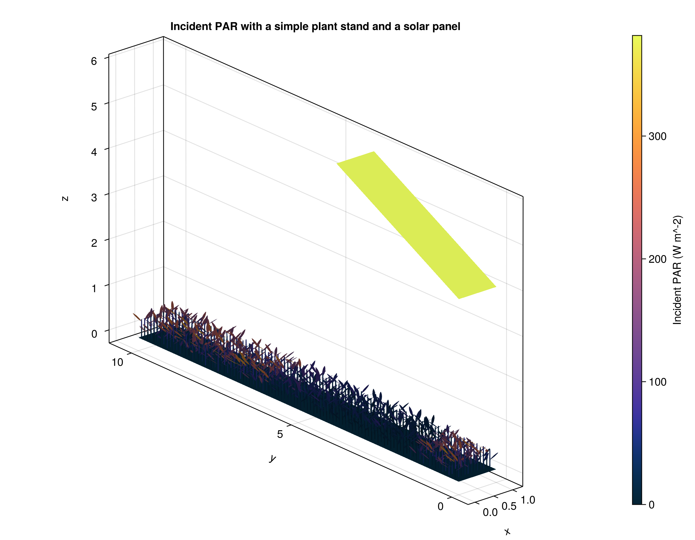

# Code to reproduce the FSPM 2026 results in the paper "Optimal design of Agrivoltaic Systems: A Functional-Structural Plant Modelling approach"

This repository contains the code to reproduce the results of the paper "Optimal design of Agrivoltaic Systems: A Functional-Structural Plant Modelling approach" by Corentin Coutellier, Rémi Vezy et al. submitted to the international conference on functional-structural plant models of 2026.

